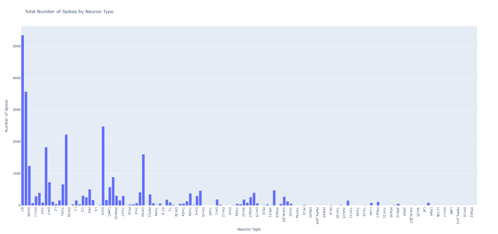
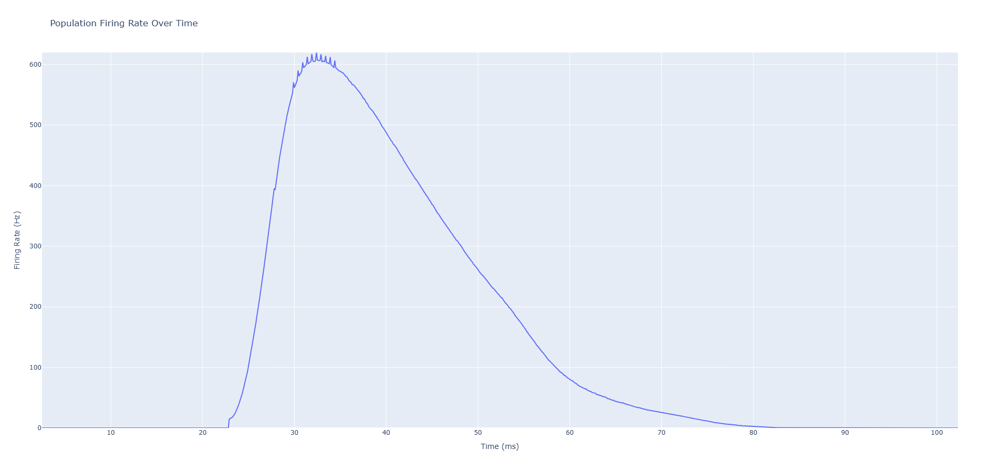

# Connectome Toolkit

Connectome Toolkit is a Python framework for processing and simulating connectomes using various methods. 

## Installation

1. Clone repository:
```bash
git clone https://github.com/SergeyFeduk/ConnectomeToolkit.git
```
2. Install dependencies:
```bash
python -m venv venv
.\.venv\Scripts\activate
pip install -r requirements.txt
```

## Example

In this example we will create and simulate a cartridge of medulla region of drosophila. 
1. Obtain processed connectome data from [flywire.ai Codex](https://codex.flywire.ai/api/download): basic Integrate and Fire simulation requires neuron types, positions and connections.
> This project was tested on snapshot v783.
2. Bake dataset using bake_dataset script and configuration file flywireai.yaml:
```bash
python.exe -m connectome_toolkit.scripts.bake_dataset -c flywireai.yaml
```
> This will create directory **"parquet_output"** and serialize connectome datasets in format compatible with framework.
3. Extract cartridge, formed from photoreceptor neuron cluster as well as immediate neighbors of those photoreceptors:
```bash
python.exe -m connectome_toolkit.scripts.extract_cartridge
```
> This will create cartridge file **"PhotoRN.cartridge"** in the root directory and show a 3D plot of it.
4. Run simulation for 100ms with timestep of 0.1ms while exciting R7 and R8 photoreceptors with function defined in simulation script:
```bash
python.exe -m connectome_toolkit.scripts.connectome_sim
```
> This will run I&F simulation on the whole cartridge and show multiple plots based on simulation results.

## Generated plots



## Contributing

Pull requests are welcome. For major changes, please open an issue first
to discuss what you would like to change.

## License

[MIT](https://choosealicense.com/licenses/mit/)